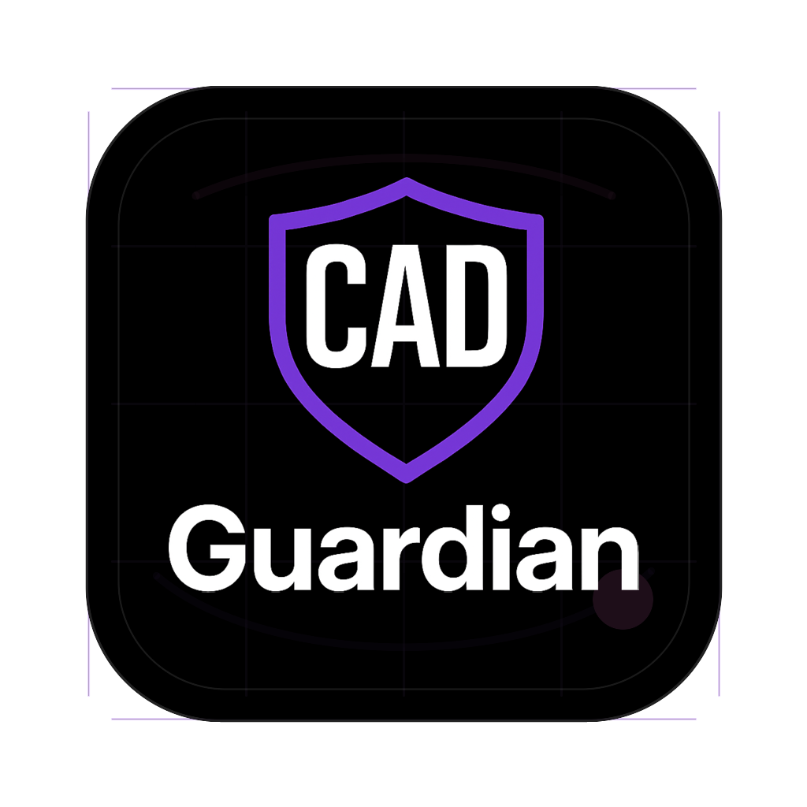

<p align="left">
  <a href="https://www.cadguardian.com/services/revit-bim-automation">
    
  </a>
</p>

# Revit and BIM Workflow Quick-Start Automation Kit

Enterprise proof repo for evaluating whether a Revit/BIM automation engagement has enough model context, review ownership, and public-safe evidence to justify moving into a licensed Revit API implementation.

**Service lane:** [CAD Guardian Revit BIM Automation](https://www.cadguardian.com/services/revit-bim-automation)

Live proof page: [GitHub Pages](https://tsmithcode.github.io/cadguardian-revit-bim-automation-proof/) | [Download ZIP](https://github.com/tsmithcode/cadguardian-revit-bim-automation-proof/archive/refs/heads/main.zip) | [CAD Guardian](https://www.cadguardian.com/) | [TSmithCode.ai](https://www.tsmithcode.ai/)

## Best for

- BIM managers evaluating document automation before private models are shared.
- Revit teams that need families, parameters, sheets, and schedules checked before native add-in work begins.
- Technical reviewers who want a runnable public proof with clear boundaries instead of screenshots or claims.
- Buyer-side conversations where the first decision is whether a private sample and Revit runtime slice are justified.

## Decision this proves

This repo proves a safe first decision: **the workflow is ready for a private BIM sample only after public fixtures show the model-context contract, family/parameter readiness, sheet/schedule boundary, and Revit API external command handoff.**

It does not claim to automate a live Revit model in public. It proves the evidence path that should exist before a licensed Revit environment touches private BIM data.

## Run locally

```bash
npm run doctor
npm run verify
npm run demo
npm run quickstart:build
npm run sanitize
```

`npm run demo` runs the C# quickstart and writes `reports/quickstart-report.json`.

## Expected output

The quickstart report should identify:

- Repo title: `Revit and BIM Workflow Quick-Start Automation Kit`
- Workflow class: `bim-document-readiness`
- Review owner: `BIM manager`
- Status: `ready-for-private-sample` when the bundled public evidence passes
- Public fixture receipts for the approved IFC files under `fixtures/public/buildingsmart/`
- Pareto checks for model context, family/parameter readiness, and sheet/schedule boundary
- Revit API signals including `IExternalCommand`, `ExternalCommandData`, `Document`, `Transaction`, `FilteredElementCollector`, `Parameter`, `FamilyInstance`, `ViewSheet`, `ViewSchedule`, `BuiltInCategory`, and `BuiltInParameter`

## Proof boundary

This is a public evidence asset for BIM context, families, parameters, sheets, schedules, and reviewer gates. It is designed to prove the shape of a responsible automation handoff before a Revit API add-in touches a live model.

The reusable proof pieces are:

- `quickstart/Program.cs`: C# package-readiness engine with fixture receipts, Pareto checks, native runtime gates, and JSON report output.
- `native/revit-addin/CadGuardianRevitCommand.cs`: optional Revit API external command scaffold for the licensed runtime boundary.
- `fixtures/public/`: approved public IFC fixtures only.
- `docs/USER_GUIDE.md`: run and adaptation guide.
- `docs/INTERVIEW_SCRIPT.md`: evaluator-safe explanation of the business case.

## What to send

For an evaluator or buyer, send:

- This repository link.
- The service page: [CAD Guardian Revit BIM Automation](https://www.cadguardian.com/services/revit-bim-automation)
- The generated report path: `reports/quickstart-report.json`
- The exact commands above.
- The decision statement: public fixtures prove the evidence path; private Revit work begins only after access, ownership, and parameter rules are approved.

## Related CAD Guardian page

[CAD Guardian Revit BIM Automation](https://www.cadguardian.com/services/revit-bim-automation)

## Native runtime boundary

The native Revit example is intentionally scoped to the Revit API external command boundary. `native/revit-addin/CadGuardianRevitCommand.cs` shows the handoff concepts: `IExternalCommand`, `ExternalCommandData`, `Document`, `Transaction`, `FilteredElementCollector`, `Parameter`, `FamilyInstance`, `ViewSheet`, `ViewSchedule`, `BuiltInCategory`, and `BuiltInParameter`.

That file requires Revit API references and a licensed Revit runtime. The public quickstart validates fixture evidence and produces a report; it does not impersonate licensed Revit execution.

## Public fixture boundary

Only approved public sample files are bundled:

- `fixtures/public/buildingsmart/Building-Architecture.ifc`
- `fixtures/public/buildingsmart/wall-with-opening-and-window.ifc`

No private names, credentials, private drawings/models, raw opportunity notes, unapproved BIM/CAD fixtures, or license-uncertain CAD assets belong in this repo.
